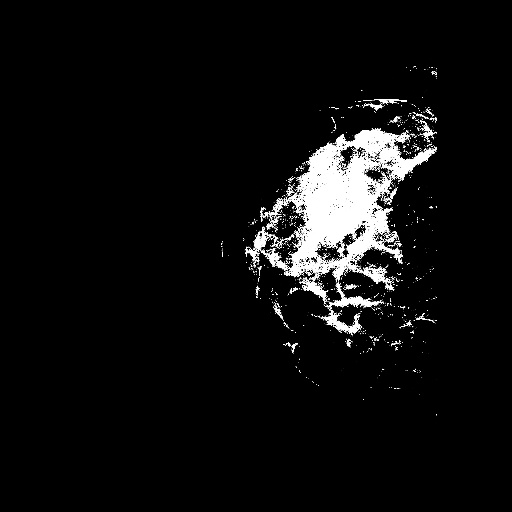
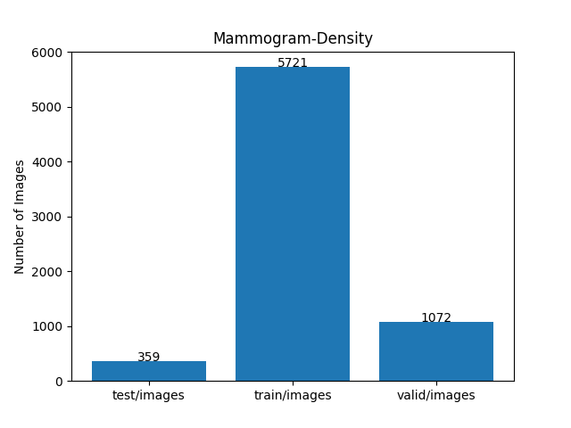
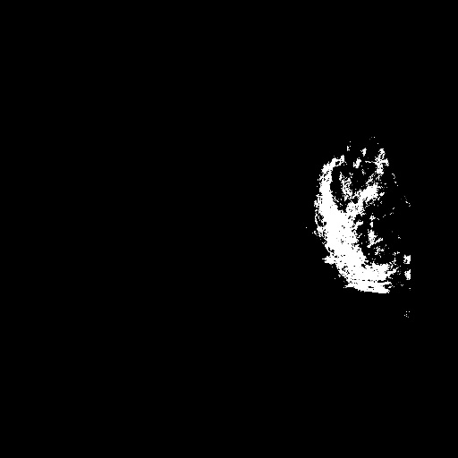

<h2>Tensorflow-Image-Segmentation-Pre-Augmented-Mammogram-Density (2025/05/09)</h2>

Sarah T. Arai 
Software Laboratory antillia.com  

This is the first experiment of Image Segmentation for Mammogram-Density
 based on 
the latest <a href="https://github.com/sarah-antillia/Tensorflow-Image-Segmentation-API">Tensorflow-Image-Segmentation-API</a>, 
and a pre-augmented <a href="https://drive.google.com/file/d/1WBjG65EXgTf-r0Ky4EhYhIXe2IbbyspP/view?usp=sharing">
Mammogram-Density-ImageMask-Dataset.zip</a>, which was derived by us from  
<a href="https://data.mendeley.com/datasets/tdx3h2fn9v/4#:~:text=This%20dataset%20consists%20of%20mammogram%20images%2C%20complete%20with,and%20breast%20area%20annotated%20by%20an%20expert%20radiologist.
">
Mammogram Density Assessment Dataset
</a>
 
 

<b>Data Augmentation Strategy:</b> 
 To address the limited size of Mammogram Density Assessment Dataset, which contains 596 images and their corresponding dense_masks in the train dataset, 
 we employed <a href="./generator/ImageMaskDatasetGenerator.py">an offline augmentation tool</a> to generate a 512x512 pixels pre-augmented dataset, which supports the following augmentation methods.
 
<li>Vertical flip</li>
<li>Horizontal flip</li>
<li>Shrinks</li>
<li>Shears</li> 
<li>Deformation</li>
<li>Distortion</li>
<li>Barrel distortion</li>
<li>Pincushion distortion</li>
 
Please see also the following tools  
<li><a href="https://github.com/sarah-antillia/Image-Deformation-Tool">Image-Deformation-Tool</a></li>
<li><a href="https://github.com/sarah-antillia/Image-Distortion-Tool">Image-Distortion-Tool</a></li>
<li><a href="https://github.com/sarah-antillia/Barrel-Image-Distortion-Tool">Barrel-Image-Distortion-Tool</a></li>
 

<b>Actual Image Segmentation for Images of 512x512 pixels</b> 
As shown below, the inferred masks look similar to the ground truth masks.  
<table>
<tr>
<th>Input: image</th>
<th>Mask (ground_truth)</th>
<th>Prediction: inferred_mask</th>
</tr>
<tr>
<td></td>
<td></td>
<td></td>
</tr>

<tr>
<td></td>
<td></td>
<td></td>
</tr>

<tr>
<td></td>
<td></td>
<td></td>
</tr>
</table>

 
In this experiment, we used the simple UNet Model 
<a href="./src/TensorflowUNet.py">TensorflowSlightlyFlexibleUNet</a> for this Mammogram-Density Segmentation Model. 
As shown in <a href="https://github.com/sarah-antillia/Tensorflow-Image-Segmentation-API">Tensorflow-Image-Segmentation-API</a>.
you may try other Tensorflow UNet Models: 

<li><a href="./src/TensorflowSwinUNet.py">TensorflowSwinUNet.py</a></li>
<li><a href="./src/TensorflowMultiResUNet.py">TensorflowMultiResUNet.py</a></li>
<li><a href="./src/TensorflowAttentionUNet.py">TensorflowAttentionUNet.py</a></li>
<li><a href="./src/TensorflowEfficientUNet.py">TensorflowEfficientUNet.py</a></li>
<li><a href="./src/TensorflowUNet3Plus.py">TensorflowUNet3Plus.py</a></li>
<li><a href="./src/TensorflowDeepLabV3Plus.py">TensorflowDeepLabV3Plus.py</a></li>

 

<h3>1. Dataset Citation</h3>

The dataset used here has been take from the following web site:  
<a href="https://data.mendeley.com/datasets/tdx3h2fn9v/4#:~:text=This%20dataset%20consists%20of%20mammogram%20images%2C%20complete%20with,and%20breast%20area%20annotated%20by%20an%20expert%20radiologist.">
Mammogram Density Assessment Dataset
</a> 
 
<b>Published:</b> 8 April 2024 Version 4 

<b>DOI:</b>10.17632/tdx3h2fn9v.4 
 
<b>Contributors:</b> 

Hamid Behravan, Naga Raju Gudhe, Hidemi Okuma, Arto Mannermaa 
 
<b>Description</b> 
This dataset consists of mammogram images, complete with corresponding segmentation masks for dense tissue  
and breast area annotated by an expert radiologist.  
 
<!--
<b>Files</b> 

<b>train.zip:</b> 
 Comprises three sub-folders: 'images', 'breast_masks', and 'dense_masks'.  
The 'images' sub-folder houses the original images. The 'breast_masks' and 'dense_masks' sub-folders contain  
the ground truth segmentation masks for the breast area and dense tissue segmentation, respectively.  
All images are in JPG format. All masks and the corresponding images have the same dimension. 
 
<b>test.zip:</b> 
Contains the images for test set in JPG format. No ground truths are provided for the test set. 
 
<b>train.csv:</b>  
The training set filelist consists of two columns. The first column is the ‘Filename’, and the second column is the ‘Density', 
 the ground truth for the breast density prediction task. 
 
<b>test.csv:</b> 
The test set filelist contains the filenames of the test sets. 
 
-->
This dataset can be utilized for tasks such as segmentation and breast density estimation.  
The mammograms were sourced from the public VinDr-Mammo dataset, which can be found at [this link] 
(https://vindr.ai/datasets/mammo). We have given annotations, including both segmentation masks and  
density values, for this public dataset. 
 
If you use this dataset in your research or other purposes, please cite the following studies:  

Gudhe, N.R., Behravan, H., Sudah, M. et al. 
<b> Area-based breast percentage density estimation in mammograms
 using weight-adaptive multitask learning.</b>  
 Sci Rep 12, 12060 (2022).  
 https://doi.org/10.1038/s41598-022-16141-2 
 
Hieu T. Nguyen et al.  
<b>A large-scale benchmark dataset for computer-aided diagnosis in full-field digital mammography.</b>  
2022. https://doi.org/10.1101/2022.03.07.22272009 
 
Related Links 
Article 
https://www.nature.com/articles/s41598-022-16141-2 
is related to this dataset 
 
<b>Licence</b> CC BY 4.0 

 
<h3>
<a id="2">
2 Mammogram-Density ImageMask Dataset
</a>
</h3>
 If you would like to train this Mammogram-Density Segmentation model by yourself,
 please download the dataset from the google drive  
<a href="https://drive.google.com/file/d/1WBjG65EXgTf-r0Ky4EhYhIXe2IbbyspP/view?usp=sharing">
Mammogram-Density-ImageMask-Dataset.zip</a>
, expand the downloaded ImageMaskDataset and put it under <b>./dataset</b> folder to be
<pre>
./dataset
└─Mammogram-Density
    ├─test
    │   ├─images
    │   └─masks
    ├─train
    │   ├─images
    │   └─masks
    └─valid
        ├─images
        └─masks
</pre>
 

On the derivation of this dataset, please refer to the following Python scripts:
<li><a href="./generator/ImageMaskDatasetGenerator.py">ImageMaskDatasetGenerator.py</a></li>
<li><a href="./generator/split_master.py">split_master.py</a></li>
 
The folder structure of the original Mammogram-Density is the following. 
<pre>
./Mammogram Density Assessment Dataset
├─test
│  └─images
└─train
    ├─breast_masks
    ├─dense_masks
    └─images
</pre>
We derived our 512x512 pixels ImageMask Dataset from dense_masks and images of 2Kx3K pixels in train dataset by using <a href="./generator/ImageMaskDatasetGenerator.py">
ImageMaskDatasetGenerator.py</a>. 
 
 
<b>Mammogram-Density Statistics</b> 
 
 
As shown above, the number of images of train and valid datasets is enough to use for a training set of our segmentation model.
 
 
<b>Train_images_sample</b> 

 
<b>Train_masks_sample</b> 

 

<h3>
3 Train TensorflowUNet Model
</h3>
 We have trained Mammogram-DensityTensorflowUNet Model by using the following
<a href="./projects/TensorflowSlightlyFlexibleUNet/Mammogram-Density/train_eval_infer.config"> <b>train_eval_infer.config</b></a> file.  
Please move to ./projects/TensorflowSlightlyFlexibleUNet/Mammogram-Density and run the following bat file. 
<pre>
>1.train.bat
</pre>
, which simply runs the following command. 
<pre>
>python ../../../src/TensorflowUNetTrainer.py ./train_eval_infer.config
</pre>

<b>Model parameters</b> 
Defined a small <b>base_filters = 16 </b> and large <b>base_kernels = (9,9)</b> for the first Conv Layer of Encoder Block of 
<a href="./src/TensorflowUNet.py">TensorflowUNet.py</a> 
and a large num_layers (including a bridge between Encoder and Decoder Blocks).
<pre>
[model]
base_filters   = 16
base_kernels   = (9,9)
num_layers     = 8
dropout_rate   = 0.05
dilation       = (1,1)
</pre>

<b>Learning rate</b> 
Defined a small learning rate.  
<pre>
[model]
learning_rate  = 0.0001
</pre>

<b>Online augmentation</b> 
Disabled our online augmentation tool. 
<pre>
[model]
model         = "TensorflowUNet"
generator     = False
</pre>

<b>Loss and metrics functions</b> 
Specified "bce_dice_loss" and "dice_coef". 
<pre>
[model]
loss           = "bce_dice_loss"
metrics        = ["dice_coef"]
</pre>
<b >Learning rate reducer callback</b> 
Enabled learing_rate_reducer callback, and a small reducer_patience.
<pre> 
[train]
learning_rate_reducer = True
reducer_factor     = 0.4
reducer_patience   = 4
</pre>

<b>Early stopping callback</b> 
Enabled early stopping callback with patience parameter.
<pre>
[train]
patience      = 10
</pre>

<b>Epoch change inference callbacks</b> 
Enabled epoch_change_infer callback. 
<pre>
[train]
epoch_change_infer       = True
epoch_change_infer_dir   =  "./epoch_change_infer"
epoch_changeinfer        = False
epoch_changeinfer_dir    = "./epoch_changeinfer"
num_infer_images         = 6
</pre>

By using this callback, on every epoch_change, the inference procedure can be called
 for 6 images in <b>mini_test</b> folder. This will help you confirm how the predicted mask changes 
 at each epoch during your training process.    

<b>Epoch_change_inference output at starting (epoch 1,2,3)</b> 
 
 
<b>Epoch_change_inference output at ending (epoch 86,87,88)</b> 
 
 

In this experiment, the training process was stopped at epoch 88  by EarlyStopping Callback.  
 
 

<a href="./projects/TensorflowSlightlyFlexibleUNet/Mammogram-Density/eval/train_metrics.csv">train_metrics.csv</a> 
 

 
<a href="./projects/TensorflowSlightlyFlexibleUNet/Mammogram-Density/eval/train_losses.csv">train_losses.csv</a> 
 

 

<h3>
4 Evaluation
</h3>
Please move to a <b>./projects/TensorflowSlightlyFlexibleUNet/Mammogram-Density</b> folder, 
and run the following bat file to evaluate TensorflowUNet model for Mammogram-Density. 
<pre>
./2.evaluate.bat
</pre>
This bat file simply runs the following command.
<pre>
python ../../../src/TensorflowUNetEvaluator.py ./train_eval_infer_aug.config
</pre>

Evaluation console output: 

  Image-Segmentation-Mammogram-Density

<a href="./projects/TensorflowSlightlyFlexibleUNet/Mammogram-Density/evaluation.csv">evaluation.csv</a> 

The loss (bce_dice_loss) to this Mammogram-Density/test was not low, and dice_coef not high as shown below.
 
<pre>
loss,0.1194
dice_coef,0.808
</pre>
 

<h3>
5 Inference
</h3>
Please move to a <b>./projects/TensorflowSlightlyFlexibleUNet/Mammogram-Density</b> folder 
,and run the following bat file to infer segmentation regions for images by the Trained-TensorflowUNet model for Mammogram-Density. 
<pre>
./3.infer.bat
</pre>
This simply runs the following command.
<pre>
python ../../../src/TensorflowUNetInferencer.py ./train_eval_infer_aug.config
</pre>

<b>mini_test_images</b> 
 
<b>mini_test_mask(ground_truth)</b> 
 

<b>Inferred test masks</b> 
 
 

<b>Enlarged images and masks </b> 

<table>
<tr>
<th>Image</th>
<th>Mask (ground_truth)</th>
<th>Inferred-mask</th>
</tr>

<tr>
<td></td>
<td></td>
<td></td>
</tr>

<tr>
<td></td>
<td></td>
<td></td>
</tr>

<tr>
<td></td>
<td></td>
<td></td>
</tr>

<tr>
<td></td>
<td></td>
<td></td>
</tr>
<tr>
<td></td>
<td></td>
<td></td>
</tr>
<tr>
<td></td>
<td></td>
<td></td>
</tr>
</table>

 

<h3>
References
</h3>
<b>1. Fully Automated Breast Density Segmentation and Classification Using Deep Learning</b> 
Nasibeh Saffari, Hatem A Rashwan, Mohamed Abdel-Nasser, Vivek Kumar Singh, Meritxell Arenas, 
 Eleni Mangina, Blas Herrera, Domenec Puig 
<a href="https://pmc.ncbi.nlm.nih.gov/articles/PMC7700286/">
https://pmc.ncbi.nlm.nih.gov/articles/PMC7700286/
</a>
 
 
<b>2. Breast Dense Tissue Segmentation with Noisy Labels: A Hybrid Threshold-Based and Mask-Based Approach</b> 
Andrés Larroza, Francisco Javier Pérez-Benito, Juan-Carlos Perez-Cortes, Marta Román, Marina Pollán, 
Beatriz Pérez-Gómez, Dolores Salas-Trejo, María Casals and Rafael Llobet 
<a href="https://www.mdpi.com/2075-4418/12/8/1822">
https://www.mdpi.com/2075-4418/12/8/1822
</a>
 
 

